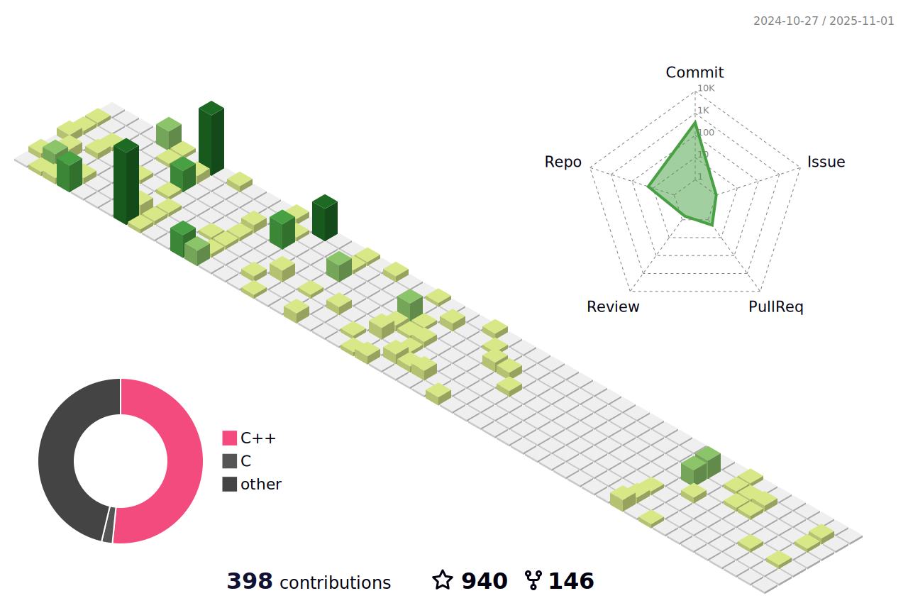

<h1 align="center">Hi</h1>

<h4 align="center">
  I'm a game engine engineer from China
</h4>

<h4 align="center">
  you can ask me about anything 💬<a href="https://github.com/Italink/Italink/issues/new" target="_blank" title="issue">here</a>
</h4>

<h5 align="center">
  
   <a href="https://www.zhihu.com/people/italink" target="_blank" title="zhihu">&nbsp;知乎&nbsp;&nbsp;&nbsp;</a>
</h5>

<h5 align="center">
 
 <a href="https://space.bilibili.com/18676598/article" target="_blank" title="bilibili">&nbsp;Bilibili</a>
</h5>

<h5 align="center">
  
 <a href="https://blog.csdn.net/qq_40946921" target="_blank" title="csdn">&nbsp;CSDN&nbsp;</a>
</h5>

**My next focus will be on creating some useful enhanced extension plugins for Unreal Engine 5.**

**If you can see its full name, it means I'm programming it：**

- **Procedural Content Processor**
- **Gaussian Splatting For UnrealEngine**
- **Vxxxxxx Cxxxxxxx**
- **Rxxxxxxx Sxxxxxxx**
- **Fxxxx Axxxxxxxx Cxxxxxx**
- **Txx Axxxxxxx ox Gxxx Pxxxxxxxxx （Blog）**
- **Uxxxxx Wxxxxxxxx Exxxxx**
- **BxxxxxxxxxC**
- **UJxxx**
- **Wxxxx Oxxxxxxxx**
- **Jxx  Hxxxxxx**

